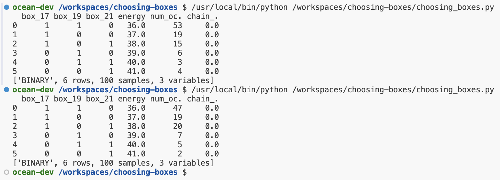

# Choosing Boxes

You're given three boxes with values 17, 21, and 19.

Write a BQM and an Ocean program that returns the pair of boxes with the
smallest sum.  A starter file has been provided for you in
``choosing_boxes.py``.

**Remember:**

You will need to choose a value for your Lagrange parameter and number of QPU
reads.  The autograder will test if your Lagrange parameter is large enough
that the desired solution (boxes 17 and 19) has the smallest value.

Please index boxes 17, 21, and 19, using the string names 'box_17', 'box_19',
and 'box_21', respectively, in your BQM.  For example, if the coefficient on
the linear term for Box 17 is 5, your program might set
`bqm.set_linear('box_17', 5)`.

## Instructions

To write your program, please complete the following in `choosing_boxes.py`:

- Build your BQM in the ``get_bqm`` function, and set the Lagrange parameter.
- Find a good value ``numruns`` in the ``run_on_qpu`` function
- Complete the main function (bottom of the file) by defining a sampler,
  running your problem on that sampler, and looking at the results.  "Looking
at the results" may be as simple as printing out the sampleset object - it's up
to you!

### Solution `choosing_boxes_solution.py`
For `numruns=100`,

## License

Released under the Apache License 2.0. See [LICENSE](LICENSE) file.
